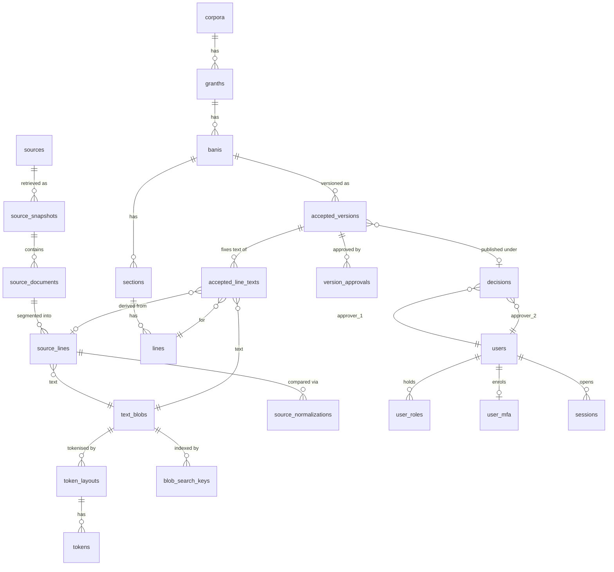

# Database

PostgreSQL. Migrations live in `corpus/migrations/NNNN_name.{up,down}.sql` and are run by
`pnpm kosh migrate up|down [--all]|status`. Each migration runs in one transaction; the runner
records a SHA-256 of every applied up-file and refuses to continue if one was edited afterwards.
**Applied migrations are immutable: write a new one.**

Roles: `kosh_public` (SELECT on `public_api.*` only), `kosh_ingest` (writes the text substrate
and source layer, nothing on accepted text or identity), `kosh_app` (DML on public tables, DELETE
only on `sessions`/`security_events`, no DDL, no TRUNCATE). All three are bound by every trigger.

## Entity overview



## Tables by migration

| #    | Tables / objects                                                                                                                                                                                                                                                                                                                                                                                                                                                                                                                                                                                                                                                                                                                                                   | Mutability  |
| ---- | ------------------------------------------------------------------------------------------------------------------------------------------------------------------------------------------------------------------------------------------------------------------------------------------------------------------------------------------------------------------------------------------------------------------------------------------------------------------------------------------------------------------------------------------------------------------------------------------------------------------------------------------------------------------------------------------------------------------------------------------------------------------ | ----------- |
| 0001 | extensions `citext`, `pg_trgm`; schemas `kosh`, `public_api`; roles; `kosh.forbid_mutation()`, `kosh.forbid_delete()`, `kosh.set_updated_at()`                                                                                                                                                                                                                                                                                                                                                                                                                                                                                                                                                                                                                     | –           |
| 0002 | `text_blobs` (sha256 UNIQUE, `raw_bytes` definitive, `raw_text COLLATE "C"`, CHECKs bytes=text, sha=sha256(bytes), cp_count=char_length); `kosh.intern_text()`; `token_layouts` (basis SOURCE_SPACING/ALIGNED_FROM_LAYOUT/HUMAN); `tokens` (bounds/overlap/contiguity trigger)                                                                                                                                                                                                                                                                                                                                                                                                                                                                                     | append-only |
| 0003 | `sources` (updatable, never deleted; **CHECK: ACTIVE requires licence + known redistribution**); `source_snapshots` (only `content_present` true→false may change; UNIQUE(source, sha256)); `source_documents`; `source_lines`; `source_normalizations`                                                                                                                                                                                                                                                                                                                                                                                                                                                                                                            | append-only |
| 0004 | `users` (citext username, Argon2id hash, **no PII columns**); `security_questions`; `user_security_answers`; `user_mfa` (encrypted TOTP secret, hashed recovery codes); `user_roles` (append-only grants with revoke; **no self-grant CHECK; trigger: EDITOR/SUPER_ADMIN require confirmed MFA**); `kosh.user_had_role_at()`; `sessions`; `anon_identities` (label `Anon-######`, no IP/device/fingerprint column)                                                                                                                                                                                                                                                                                                                                                 | see notes   |
| 0005 | `corpora`→`granths`→`banis` (verification_state SOURCE_ONLY/PROVISIONAL/REVIEWED/LOCKED)→`sections` (recursive)→`lines` (no text); `bani_aliases`; `collections`, `bani_variants`, `bani_variant_ranges`, `collection_items`; **`decisions`** (two approvers with roles captured; CHECK a1≠a2; CHECK eligible roles; UNLOCK needs two SUPER_ADMINs; trigger: approvers genuinely held roles at `decided_at`, adoption only from ACTIVE + redistributable source); **`accepted_versions`** (DRAFT→PUBLISHED→SUPERSEDED only; version_no assigned by trigger; publish requires matching-kind decision for the same Bani and ≥1 line text; auto-supersede; moves Bani state); `accepted_line_texts` (frozen once not DRAFT; layout must belong to blob); `bani_locks` | append-only |
| 0006 | `audit_log` (append-only; auto rows for decisions and role grants/revokes); `security_events` (14-day expiry; `ip_bucket` reserved, unused so far); views `public_api.sources/source_snapshots/banis/lines/tokens/versions/statistics`; all grants                                                                                                                                                                                                                                                                                                                                                                                                                                                                                                                 | –           |
| 0007 | `source_documents.parser_version/input_format/parsed_at/line_count`; **`version_approvals`** (PK version+user; trigger captures the approver's real role and refuses non-eligible accounts and non-DRAFT versions); `blob_search_keys` (first-letter key + compare-v1 text, trigram index); views `public_api.sections`, `public_api.search_lines`; grants (incl. `audit_log` INSERT for `kosh_ingest`)                                                                                                                                                                                                                                                                                                                                                            | append-only |
| 0008 | view `public_api.version_lines` (text of PUBLISHED and SUPERSEDED versions, same licence gate, drafts excluded); `public_api.tokens` widened to every layout in a public version                                                                                                                                                                                                                                                                                                                                                                                                                                                                                                                                                                                   | –           |

## Invariants enforced by the database (not by application code)

1. Text is never updated or deleted (`text_blobs`, `tokens`, `source_*`, `accepted_line_texts`, `decisions`, `version_approvals`, `audit_log`, `blob_search_keys` reject UPDATE/DELETE).
2. `raw_bytes = convert_to(raw_text,'UTF8')` and `sha256 = sha256(raw_bytes)`: a blob cannot be inconsistent.
3. A source cannot be ACTIVE without a licence and a known redistribution status.
4. Adoption decisions from PROHIBITED/UNKNOWN or non-ACTIVE sources are refused.
5. Two approvers, two distinct accounts, both EDITOR/SUPER_ADMIN **at the time**; roles are captured from live grants by trigger, never supplied by the caller.
6. A version is inserted as DRAFT, can be published only with a matching decision and at least one line text, and publishing supersedes the previous published version. One PUBLISHED per Bani (partial unique index).
7. Rollback is a new version (`basis = ROLLBACK`, `rolled_back_to_id`), inheriting the lineage root source.
8. Privileged roles require confirmed MFA before the grant takes effect; nobody can grant themselves a role.
9. `public_api.lines` exposes only PUBLISHED text whose lineage-root source is ALLOWED or ATTRIBUTION_REQUIRED; drafts never appear.
10. `kosh_public` cannot write anywhere and cannot read identity, drafts or raw tables.

Every invariant above has a test in `corpus/test/invariants.test.ts`.

## Verification lifecycle of a Bani

```
SOURCE_ONLY ──(SOURCE_ADOPTION published)──▶ PROVISIONAL ──(CORRECTION/ROLLBACK published)──▶ REVIEWED ──(LOCK)──▶ LOCKED
```

PROVISIONAL text must be shown to readers with its source tag (RISK_REGISTER R-02).

## Conventions

- ids are `bigserial`, handled as **strings** in application code (both drivers return int8 as text).
- Timestamps are `timestamptz`.
- Enum-like vocabularies are PostgreSQL enums, mirrored in `packages/domain/src/vocab.ts`.
- Every write of business significance also writes an `audit_log` row in the same transaction.
